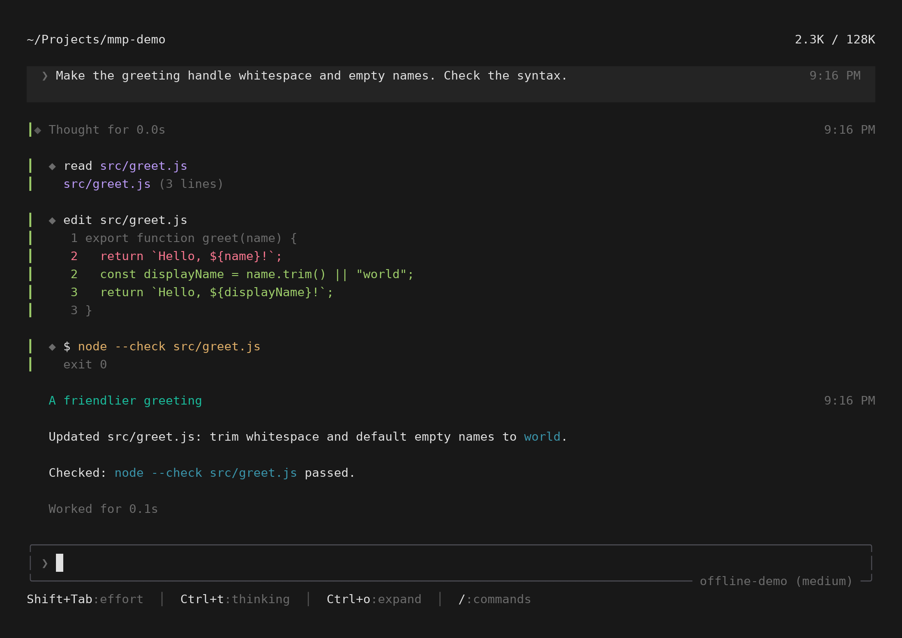
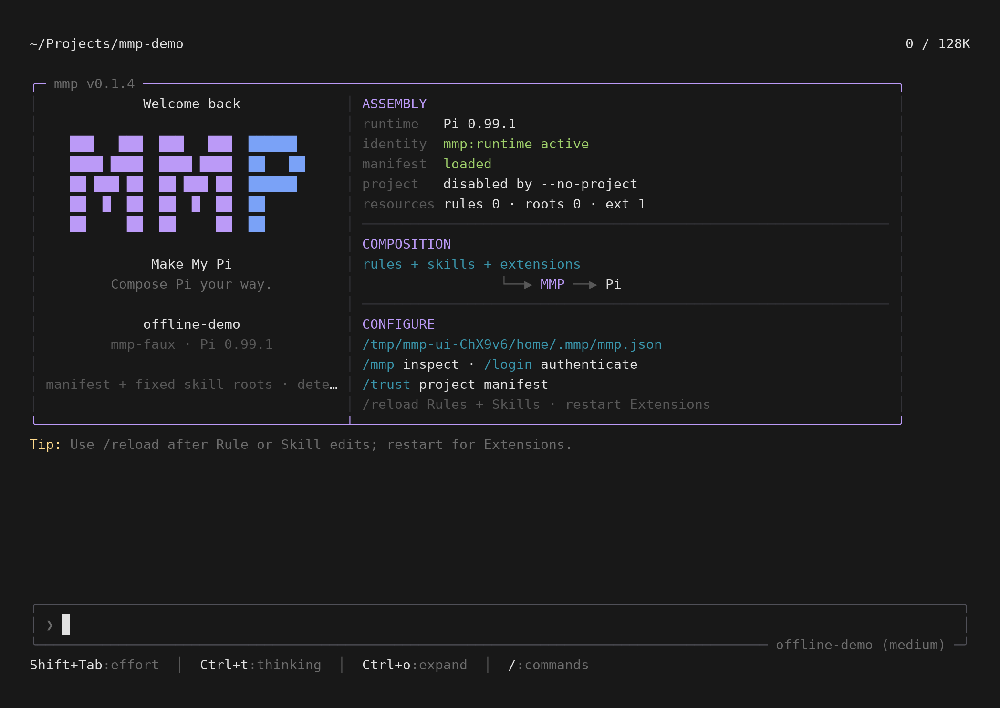

# Make My Pi

> Compose Pi your way.

MMP (Make My Pi) 是基于 Pi SDK 的可定制终端编程助手。自有 grok 风格 TUI，组合 Skills、MCP、Hooks 与隔离子任务；Pi 提供模型、Agent Loop 与 Session，MMP 管理界面、配置、信任和能力装配。



*真实 TUI，离线演示数据。思考、文件修改与命令执行集中呈现。*

<details>
<summary>查看启动页</summary>



[截图生成方式](docs/assets/README.md)

</details>

## 要点

- **自有界面**：按 grok-build 设计的全屏终端界面，对话、思考、工具调用和文件修改集中呈现。
- **建在 Pi 上**：模型、Agent Loop、Session 用锁定版本的 Pi SDK，功能和 Pi 对齐。
- **配置只属于 MMP**：独立的 `~/.mmp`，不读 Pi 或其他工具的配置，不认 `PI_*` 环境变量；项目配置要先信任。
- **显式装配**：Rules、Skills、Extensions 由 Manifest 声明；内建 Task（子任务）、MCP、Hooks 默认开启，可以关掉。
- **不用离开终端去审查**：`/preview` 在 MMP 里看文件、Markdown、图片和视频。

## 最近更新

**0.1.11：预览的小修正，以及命令不能重名**

- `/preview` 0.1.1：正在看的文件或目录被删后显示 `xxx not found`；读不了的目录说明原因，不再显示成空目录；名字里有换行的文件不插入引用，会提示。
- 两个扩展注册同名命令时（包括和内置的 `/preview`、`/mcp` 同名），MMP 启动就报错并说明是哪两个，而不是悄悄把它们改名成 `/xxx:1`、`/xxx:2`。

**0.1.10：在 MMP 里看文件（`/preview`）**

改完代码不用再切到编辑器去看结果。`/preview` 打开一个三栏的文件浏览器和查看器，能看带语法高亮的代码、渲染后的 Markdown、图片和视频。

```text
/preview                      在当前目录打开浏览器
/preview src/tui              在某个目录打开
/preview docs/architecture.md 直接打开一个文件（Markdown 会渲染，按 r 看源码）
/preview demo/clip.mp4        直接播放一个视频（需要本机有 ffmpeg）
```

在浏览器里用 `j`/`k` 移动、回车打开、`h` 回上级、`/` 过滤；按 `i` 把选中文件的 `@路径` 插进输入框，交给 agent 继续处理。图片和视频画面需要终端支持图形协议（Ghostty、kitty、iTerm2 等）。完整说明见 [Preview](docs/guide/preview.md)。

**0.1.9：`-p`、json、rpc 更稳**

- 机器忙时 `mmp -p` 偶尔报 "No API key found for the selected model" 的问题修掉了。
- 项目里的 `.pi/settings.json` 不再能改会话的保存位置。
- 内置的 Magpie 网关每次启动都会同步模型列表，不管这次用的是哪个 provider。

## 快速开始

```bash
curl --proto '=https' --tlsv1.2 -fsSL \
  https://github.com/RoacherM/mmp/releases/latest/download/install.sh | sh
mmp
```

要求 Node.js `>=22.19.0`。启动后用 `/login` 登录模型服务。

## 文档

- [使用文档](docs/guide/README.md)：[安装与升级](docs/guide/install.md) · [命令行](docs/guide/cli.md) · [配置](docs/guide/configuration.md) · [Preview](docs/guide/preview.md) · [Task](docs/guide/task.md) · [MCP](docs/guide/mcp.md) · [Hooks](docs/guide/hooks.md)
- 开发：[架构设计（原则）](docs/architecture.md) · [实现与契约](docs/development.md) · [开发流程](docs/dev-workflow.md)（[自举流程](docs/dev-workflow-herdr.md)、[通用的工作流图（wayne-skills 的 workflow-graph skill）](https://github.com/RoacherM/Wayne-Skills/blob/main/skills/workflow-graph/SKILL.md)） · [设计决策](docs/decisions.md)；给开发代理的入口是 [AGENTS.md](AGENTS.md)
